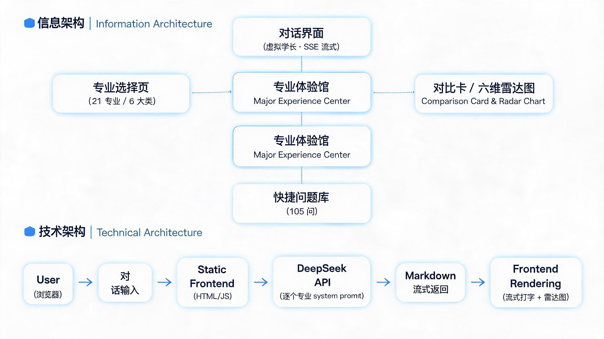

# AI 虚拟学长 · ai-virtual-senior

> 为 21 个专业各配置独立的 system prompt，用 DeepSeek API 提供 SSE 流式对话——解决"高中生选专业信息不对称、新生问题没人问"的问题。

🔗 在线 Demo：https://12c0bda130b64a6aa6cd44bd7fcd38bf.bj8.agentos-app.net/ai-senior-chatbot.html

📄 [精简 PRD](./docs/精简PRD.md)

## 🧭 架构图



> 信息架构（专业选择页 / 对话界面 / 对比卡·雷达图 / 快捷问题库）+ 技术架构（静态前端 → DeepSeek API → 流式渲染）。点击放大查看。

## 产品截图

> 项目为「可感可视化大学专业体验馆」的 AI 对话模块，覆盖 21 个专业 / 6 大专业大类 / 105 个快捷问题。
> 建议补充：对话页实拍截图、专业详情页（六维雷达图）截图（见文末「待改进」）。

## 这个产品解决什么问题

高中生选专业时严重信息不对称——专业名称耳熟能详，但真实的学习内容、课程难度、就业方向全凭想象。这个产品构建"可感可视化大学专业体验馆"：**"想象 vs 现实"对比卡**让差距可感，**六维雷达图**让专业特征可视化，**AI 虚拟学长**让真实体验可对话。覆盖 21 个专业，每个有独立 AI 身份与知识库，让用户在填报志愿前"提前走进真实大学生活"。

## 核心功能

- 21 个专业独立 system prompt：不同专业有各自的知识边界与回答风格，AI 学长以该专业在读学生身份回答
- SSE 流式对话：逐字流式输出，打字机效果提升感知速度，Markdown 实时渲染
- 每专业 5 个快捷问题引导冷启动，30 轮对话限制控制成本

## 为什么这样做（产品决策）

- **用户痛点 → 方案**：我观察到"选专业靠想象"是普遍痛点（自己学建筑后深有体会），因此选择「可感 + 可视化 + 可对话」三屏方案，让差距可感、特征可见、体验可聊。
- **取舍（Prompt 工程）**：在「一个通用大模型」和「21 个专业独立 system prompt」之间优先了后者——通用模型回答容易泛泛而谈，只有按专业拆分 prompt 才能给出有专业感的答案。这是本项目最核心的差异化亮点。
- **取舍（平台 vs 自建）**：放弃 Coze 平台（积分消耗过快不适合长期运行），改为 DeepSeek API + 纯 HTML 单页应用，零后端依赖、打开即用、成本可控。
- **数据/验证**：覆盖 21 个专业 / 6 大专业大类 / 105 个快捷问题；API Key base64 嵌入避免明文暴露，配合 30 轮对话限制控制成本，保证产品可持续运行。

## 技术架构

- 模型 / API：DeepSeek API
- 关键能力：Prompt 工程（21 个专业独立 system prompt）· SSE 流式对话 · Markdown 渲染
- 前端：纯 HTML 单页应用，marked.js 渲染 Markdown
- 后端：Node.js 服务，管理 21 个专业 prompt 配置

## 如何运行

```bash
# 1. 安装依赖
npm install

# 2. 配置环境变量（复制 .env.example 为 .env 并填写）
cp .env.example .env

# 3. 启动开发服务
npm run dev
```

## 环境变量

```env
# 服务端口
PORT=3000

# DeepSeek API Key（请使用你自己的 Key，切勿提交真实值）
DEEPSEEK_API_KEY=sk-xxxxxxxxxxxxxxxx

# DeepSeek API 地址
DEEPSEEK_API_BASE=https://api.deepseek.com
```

## 目录结构

```
ai-virtual-senior/
├── index.html              ← 专业体验馆主页面（作品集提取）
├── ai-senior-chatbot.html  ← AI 虚拟学长对话页（作品集 Demo）
├── README.md               ← 本文件
└── .env.example            ← 环境变量示例
```

## 待改进（Roadmap）

- [ ] 补充 21 个专业 system prompt 的脱敏示例（Prompt 工程亮点展示）
- [ ] 补充对话页与专业详情页截图
- [ ] 补充对话成本统计面板
- [ ] 补充完整业务代码

## License

MIT
